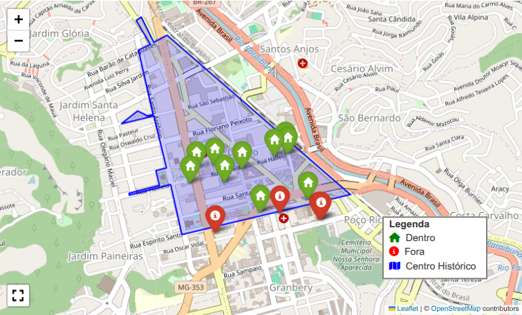

## Memória mapeada: o percurso de Raphael Arcuri no centro histórico de JF

### Introdução

Os dados vetoriais permitem representar objetos geográficos de forma
precisa e estruturada. Como exemplo, utilizamos dois objetos já tratados
anteriormente: o **Museu de Percurso Raphael Arcuri** e o **Centro
Histórico** da cidade de Juiz de Fora, em Minas Gerais, cada um
representado por entidades geométricas distintas -- pontos e polígonos,
respectivamente.

O [Museu de Percurso Raphael
Arcuri](https://www.instagram.com/museuraphaelarcuri?igsh=MWRjNWV1cnZnczE5aQ==),
idealizado por [Letícia
Rabelo](https://www.instagram.com/leticiarabelo.arq?igsh=dndsYTdsemM4ZWdw),
ganha ainda mais relevância quando analisado em conjunto com o Decreto
Municipal 17.025/2025, que estabelece os limites oficiais do **Centro
Histórico**. Este decreto, publicado em janeiro de 2025, visa não apenas
preservar o patrimônio histórico, mas também impulsionar o comércio
local e o turismo na região.

Ao sobrepor os pontos do **Museu de Percurso** ao polígono do **Centro
Histórico** -- utilizando ferramentas de análise espacial em Python --,
observamos que obras icônicas como o *Paço Municipal* e o *Cine Theatro
Central* se encontram dentro da área delimitada, enquanto outras
igualmente significativas, como as *residências da família Arcuri* e a
*Vila Iracema,* situam-se além desses limites. Essa análise não apenas
destaca a importância do núcleo histórico central, mas também levanta
questões sobre a extensão do patrimônio arquitetônico pela cidade.

**Importamos as bibliotecas**

``` python
import pandas as pd
import folium
from folium.plugins import Fullscreen
from pyproj import Transformer, Proj
from shapely.geometry import Polygon, Point
from geopy.distance import geodesic
```

**Carregamos os pontos do Museu de Percurso**

``` python
df_obras = pd.DataFrame(
    [['Paço Municipal', -21.761600, -43.349999],
     ['ED. CIAMPI', -21.7608312, -43.3496202],
     ['Galeria Pio X', -21.7606305, -43.3484793],
     ['Cine Theatro Central', -21.7615775, -43.3478918],
     ['Palacete Pinho', -21.7608331, -43.3468349],
     ['Cia. Dias Cardoso', -21.7601146, -43.3448549],
     ['Hotel Príncipe', -21.7599733, -43.3440394],
     ['Associação Comercial', -21.7597099, -43.3441725],
     ['Cia. Pantaleone Arcuri', -21.762536, -43.342788],
     ['Vila Iracema', -21.763336, -43.344481],
     ['Palacete dos Fellet', -21.763280, -43.345717],
     ['Residência Raphael Arcuri', -21.763699, -43.342097],
     ['Castelinho dos Bracher', -21.763666, -43.341959],
     ['Casa D\'Itália', -21.764455, -43.348467]],
    columns=['obra', 'latitude', 'longitude']
)
```

**Definimos o polígono do Centro Histórico**

``` python
vertices_utm = [
    (671631.01298, 7592562.9258),  
    (670483.76674, 7593577.0383),  
    (670398.10899, 7593532.9851),  
    (670322.59534, 7593692.0525),  
    (670290.67635, 7593669.7837),  
    (670377.32049, 7593520.1438),  
    (670302.54290, 7593484.0129),  
    (670391.01186, 7593079.2177),  
    (670353.52763, 7593071.3745),  
    (670291.86401, 7593099.9004),  
    (670188.72948, 7593021.7110),  
    (670392.36957, 7593068.9978),  
    (670471.79272, 7592740.6347),  
    (670401.69082, 7592724.5514),  
    (670423.71811, 7592633.6294),  
    (670231.47881, 7592584.9345),  
    (670234.18470, 7592574.6061),  
    (670494.86684, 7592637.8945),  
    (670565.63917, 7592323.5994)
]
```

**Identificamos quais pontos estão dentro e fora do polígono**

``` python
# Converter coordenadas UTM para WGS84 (lat/lon)
proj_utm = Proj(proj='utm', zone=23, south=True, ellps='GRS80', datum='WGS84')
transformer = Transformer.from_proj(proj_utm, 'epsg:4326')
vertices_wgs84 = [transformer.transform(easting, northing) for easting, northing in vertices_utm]

# Criar polígono Shapely 
polygon = Polygon([(lon, lat) for lat, lon in vertices_wgs84])

# Função para verificar se ponto está dentro do polígono
def is_inside(lat, lon):
    point = Point(lon, lat)  # Shapely usa (longitude, latitude)
    return polygon.contains(point)

# Aplicar a função corrigida
df_obras['dentro'] = df_obras.apply(lambda row: is_inside(row['latitude'], row['longitude']), axis=1)
```

**Criamos um mapa interativo**

``` python
# Centralizar o mapa
avg_location = df_obras[['latitude', 'longitude']].mean().tolist()
mapa = folium.Map(location=avg_location, zoom_start=14)

# Adicionar polígono do Centro Histórico (folium usa [latitude, longitude])
folium.Polygon(
    locations=[[lat, lon] for lat, lon in vertices_wgs84],
    color='blue',
    weight=2,
    fill=True,
    fill_color='blue',
    fill_opacity=0.2,
    tooltip='Centro Histórico de Juiz de Fora'
).add_to(mapa)

# Adicionar pontos do Museu de Percurso
for idx, row in df_obras.iterrows():
    color = 'green' if row['dentro'] else 'red'
    icon = folium.Icon(color=color, icon='home' if row['dentro'] else 'info-sign')
    
    folium.Marker(
        location=[row['latitude'], row['longitude']],
        popup=f"<b><br>Status:</b> {'Dentro' if row['dentro'] else 'Fora'} do Centro Histórico",
        tooltip=row['obra'],
        icon=icon
    ).add_to(mapa)

# Adicionar controles de tela cheia
Fullscreen(
    position='bottomleft',
    title='Expandir',
    title_cancel='Sair',
    force_separate_button=True
).add_to(mapa)

# Adicionar legenda
legend_html = '''
     <div style="position: fixed; 
     bottom: 50px; right: 50px; width: 150px; height: 90px; 
     border:2px solid grey; z-index:9999; font-size:14px;
     background-color:white;
     ">
     &nbsp; <b>Legenda</b> <br>
     &nbsp; <i class="fa fa-home" style="color:green"></i>&nbsp; Dentro <br>
     &nbsp; <i class="fa fa-info-circle" style="color:red"></i>&nbsp; Fora <br>
     &nbsp; <i class="fa fa-map" style="color:blue"></i>&nbsp; Centro Histórico
     </div>
     '''
mapa.get_root().html.add_child(folium.Element(legend_html))

mapa.save("mpra_in_chjf.html")

mapa
```



**Considerações finais**

Ferramentas de georreferenciamento e análise espacial permitem
visualizar a relação entre o **Museu de Percurso Raphael Arcuri** e o
**Centro Histórico** de forma clara. A interseção entre dados históricos
e geográficos não só enriquece nossa compreensão do patrimônio cultural,
mas também apoia tomadas de decisão mais embasadas.

Baixe o arquivo *mpra_in_chjf.hmtl*, para visualizar o mapa interativo no navegador da sua preferência.


**Referências**

Centro Histórico de Juiz de Fora é delimitado. **Tribuna de Minas**,
Juiz de Fora, publicado em 24/01/2025 às 13h30. Caderno Cidade.
Disponível em:
<https://tribunademinas.com.br/noticias/cidade/24-01-2025/centro-historico-jf.html>.

DECRETO Nº 17.025, de 23 de janeiro de 2025. Prefeitura Municipal de
Juiz de Fora. Publicado no Diário Oficial Eletrônico do Município de
Juiz de Fora - Atos do Governo do do Poder Executivo, em 24/01/2025.
Disponível em:
<https://www.pjf.mg.gov.br/e_atos/e_atos_vis.php?id=126353>.

Ferreira, G. (2025). Centro Histórico de Juiz de Fora. Publicado em
26/01/2025. LinkedIn. Disponível em:
<https://www.linkedin.com/pulse/centro-hist%C3%B3rico-de-juiz-fora-guilherme-ferreira-5wshf/?trackingId=mNyOlJLqld7YcMdTpzpi6w%3D%3D>.

Ferreira, G. (2025). Museu de Percurso Raphael Arcuri. Publicado em
08/06/2025. LinkedIn. Disponível em:
<https://www.linkedin.com/pulse/museu-de-percurso-raphael-arcuri-guilherme-ferreira-v8i2f/?trackingId=1jNy2WyuQiqb8VEqlsBznQ%3D%3D>.

Uribe, C. J. (2024). *An intelligent decision support system for tourism
in Python*. Publicado em Jan 16, 2024. Disponível em:
<https://medium.com/@carlosjuribe/list/an-intelligent-decision-support-system-for-tourism-in-python-b6ba165b4236>.
